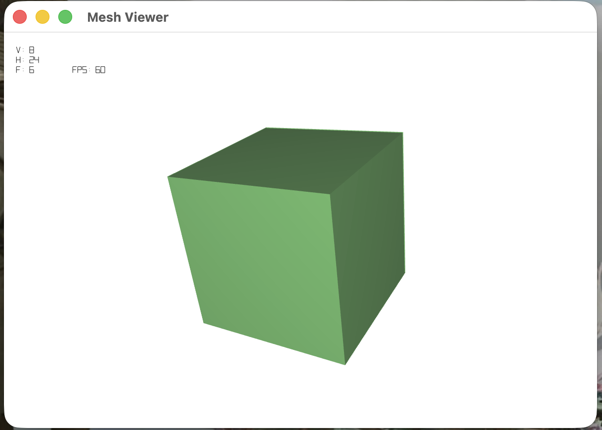
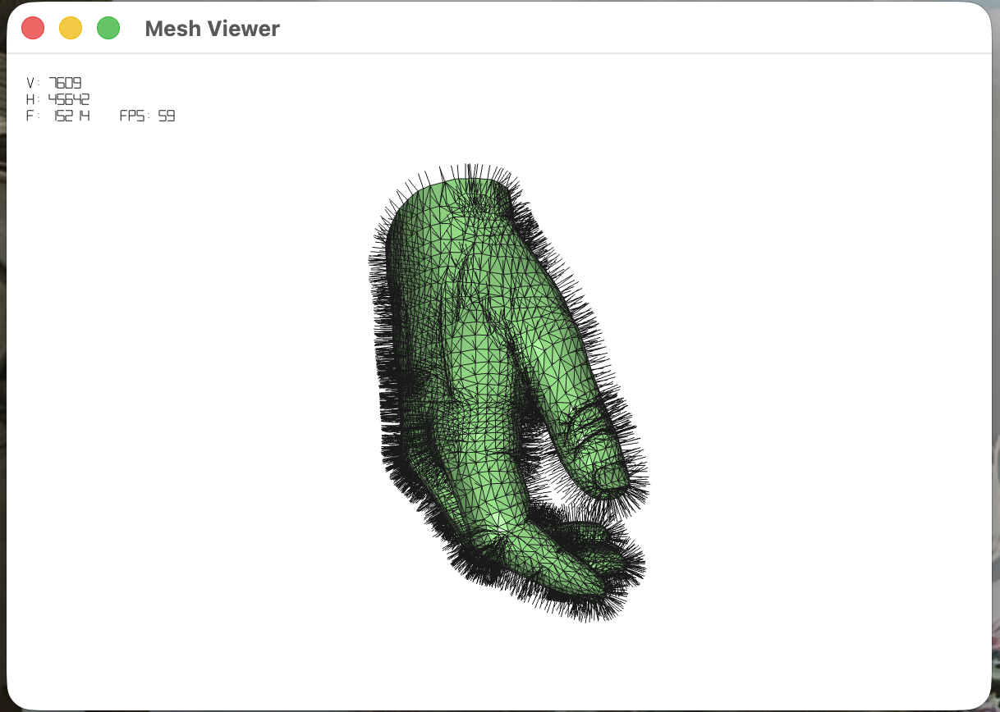
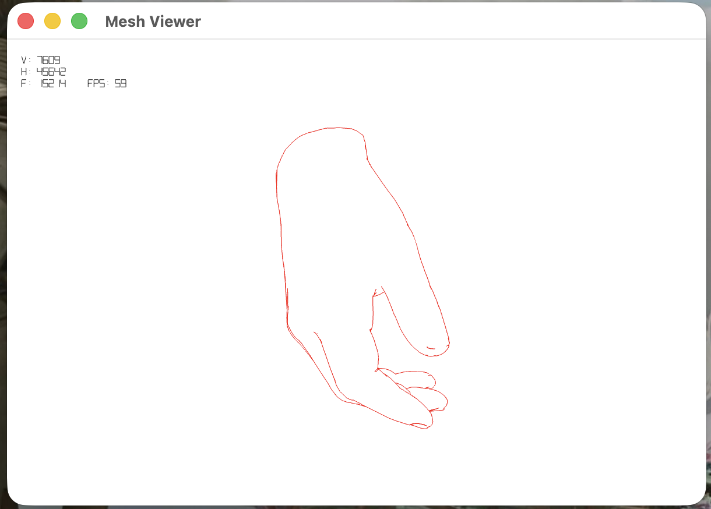
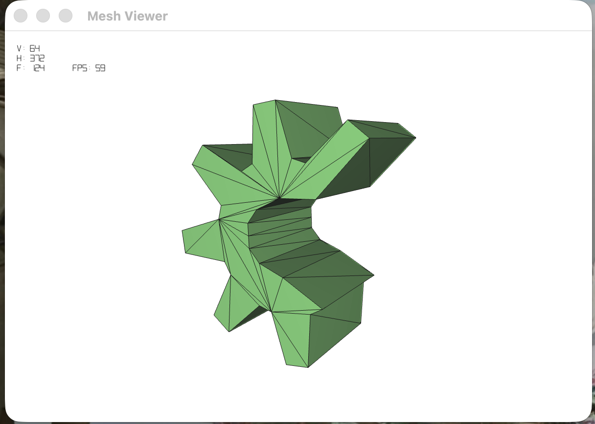

# geometric-modeling

Used the version from Iakov given in discord the 07/04/2026 in the discord in the ressoources channel. 
Prior to this I was using my own version and made AI corrections to make this version work on my mac but had way to much problems so I switched over to Iakov’s.

### Disclaimer AI Usage 

I used AI in this project mostly for problem solving such as bug related to compiling the code (zsh segmentations errors).
When the programs was going through the mesh and going out of bounds most of the time. 
As well as to understand some concepts which I didn't get in class (such as surface of revolution). 


# Mesh Viewer (OpenGL 3.3 + SDL2)

Read me from Iakov for the base project. 

Cross-platform CMake build (Windows, Linux, macOS) with modern OpenGL rendering/picking and SDL2 window/input layer.

## Build Requirements

- CMake 3.20+
- C++17 compiler
- OpenGL
- Git (for `FetchContent` dependencies)
- Internet access during first configure

## Build

Same commands on Windows, Linux, and macOS:

```bash
cmake -S . -B build -DCMAKE_BUILD_TYPE=Release
cmake --build build --config Release --parallel
```

The executable is named `meshviewer`.


## Reporting

This section documents the detailed code implementation for each of the functions completed in this project. The system is built on a **Half-Edge Data Structure**, which enables efficient traversal of vertices, edges, and faces.

---

### 1. `myMesh.cpp : readFile(std::string filename)`

#### Concept & Purpose
Reads 3D mesh data from a `.obj` file and builds a fully connected half-edge mesh topology in memory.

#### How it is Implemented in the Code
1. **File Parsing:** Opens the file using `std::ifstream` and reads it line-by-line. Lines starting with `v` define vertices (X, Y, Z coordinates), and lines starting with `f` define faces (vertex indices).
2. **Vertex Allocation:** For every `v`, it creates a new `myPoint3D` and `myVertex` and adds it to the `vertices` list.
3. **Face & Half-Edge Creation:** For every `f`, it reads the vertex indices, converts them to 0-indexed values, and allocates an array of half-edges (`hedges`) corresponding to the number of vertices forming the face.
4. **Linking Next & Prev:** Loops through the face vertices and connects the half-edges sequentially:
   - `hedges[i]->next = hedges[iplusone]`
   - `hedges[i]->prev = hedges[iminusone]`
   - `hedges[i]->adjacent_face = f`
5. **Connecting Twins:** Employs a lookup map (`twin_map`) keyed on vertex pairs `(v_start, v_end)`. For each directed half-edge from `v_start` to `v_end`, it checks if the reverse directed edge `(v_end, v_start)` was already registered. If so, they are linked as twins (`twin`). If not, the current half-edge is added to the map.
6. **Finalizing:** Calls `checkMesh()` to ensure all edges have a twin (i.e. the mesh has no open boundary/cracks) and `normalize()` to center and scale the model.

> **Visual Space:**
> 

---

### 2. Normal Computations
* **`myMesh.cpp : computeNormals()`**
* **`myVertex.cpp : computeNormal()`**
* **`myFace.cpp : computeNormal()`**

#### Concept & Purpose
Computes directional vectors (normals) perpendicular to faces (flat shading) and vertices (smooth shading) for lighting and silhouette calculations.

#### How it is Implemented in the Code
* **`myFace::computeNormal()`:**
  - Passes the positions of three consecutive vertices around the face loop to a helper: `normal->setNormal(v0, v1, v2)`.
  - The helper calculates the cross product of the vectors forming two edges: $(v_1 - v_0) \times (v_2 - v_0)$, and normalizes it.
* **`myVertex::computeNormal()`:**
  - Starts at the vertex's outgoing edge `originof`.
  - Loops around the vertex's adjacent faces using the half-edge traversal rule `step = step->twin->next`.
  - Accumulates the normals of all adjacent faces and divides by the count to find the average normal, creating a smooth vector.
* **`myMesh::computeNormals()`:**
  - Iterates through all faces to compute face-level normals, then iterates through all vertices to compute vertex-level normals.

> **Visual Space (Flat vs Smooth Shading):**
> 

---

### 3. `main.cpp : if (drawsilouette)`

#### Concept & Purpose
Identifies and draws the boundary outlines (silhouettes) of the 3D model relative to the viewer's camera position.

#### How it is Implemented in the Code
1. **Camera Vector:** Inside `display()`, when `drawsilhouette` is active, it loops through all half-edges in the mesh. For each half-edge `e` from vertex `v1` to `v2`, it computes a 3D vector from the vertex `v1` pointing to the camera (`camera_eye`).
2. **Visibility Check:** Calculates the dot products between this camera vector and the normals of the two faces meeting at this edge:
   - $d_1 = \text{normal}(e\rightarrow \text{adjacent\_face}) \cdot \text{toCamera}$
   - $d_2 = \text{normal}(e\rightarrow \text{twin}\rightarrow \text{adjacent\_face}) \cdot \text{toCamera}$
3. **Silhouette Condition:** If $d_1 \times d_2 < 0$, one face is facing towards the camera (positive dot product) and the other is facing away (negative dot product).
4. **Drawing:** If this condition is met, the coordinates of `v1` and `v2` are pushed to a vertex buffer and drawn on screen as a thick red overlay line.

> **Visual Space:**
> 

---

### 4. `myMesh.cpp : triangulate()` & `bool triangulate(myFace *f)`

#### Concept & Purpose
Converts non-triangular faces (polygons with 4 or more vertices) into triangles, making the mesh compatible with standard GPU rendering pipelines.

#### How it is Implemented in the Code
* **`triangulate(myFace *f)`:**
  - Checks if the face is already a triangle by testing if walking three steps along the edge loop returns to the starting edge. If so, it returns `false`; otherwise, it returns `true`.
* **`triangulate()`:**
  - Implements the **Ear Clipping Algorithm** for each face.
  - While a face has 4 or more vertices, it searches for a valid "ear"—a set of three consecutive vertices $(a, b, c)$ where:
    1. The vertex $b$ is convex (checked by comparing its cross product against the overall face normal).
    2. No other vertex of the face lies inside the triangle $abc$ (checked using halfplane tests).
  - Once a valid ear is found (delimited by half-edges `h0`, `h1`, `h2`), it clips it off:
    - Creates a new internal diagonal half-edge (`new_he`) and its twin (`new_he_twin`) connecting `h2->source` to `h0->source`.
    - Creates a new face (`new_face`) for the clipped triangle, and links `h0`, `h1`, and `new_he` to it.
    - Updates the original face `f` to bypass the clipped ear by linking it to `new_he_twin` and the remaining boundary edges.

> **Visual Space:**
> 

---

### 5. `myMesh.cpp : splitFaceTRIS(myFace *f, myPoint3D *p)`

#### Concept & Purpose
Inserts a new vertex `p` inside a triangular face `f` and subdivides it into three smaller triangles.

#### How it is Implemented in the Code
1. **Vertex Insertion:** Allocates a new vertex `vP` with the coordinates of point `p` and adds it to the mesh's vertex list.
2. **Edge Boundary Lookup:** Identifies the three existing boundary half-edges of the face: `h0`, `h1`, and `h2`.
3. **Allocation:** Creates 6 new half-edges (three pairs of twins: `e0/e0_twin`, `e1/e1_twin`, `e2/e2_twin`) and 2 new faces (`f1`, `f2`).
4. **Chaining the Loops:** Re-links pointers to form three independent triangular loops:
   - **Triangle 1 (Face `f`):** `h0` $\rightarrow$ `e0` $\rightarrow$ `e2_twin` $\rightarrow$ `h0`.
   - **Triangle 2 (Face `f1`):** `h1` $\rightarrow$ `e1` $\rightarrow$ `e0_twin` $\rightarrow$ `h1`.
   - **Triangle 3 (Face `f2`):** `h2` $\rightarrow$ `e2` $\rightarrow$ `e1_twin` $\rightarrow$ `h2`.
5. **Twin Stitching:** Manually connects the twins of the inner radiating edges:
   - `e0->twin = e2_twin`
   - `e1->twin = e0_twin`
   - `e2->twin = e1_twin`
6. **Database Update:** Pushes the new edges and new faces to the mesh database.

> **Visual Space:**
> 

---

### 6. `myMesh.cpp : splitEdge(myHalfedge *e1, myPoint3D *p)`

#### Concept & Purpose
Subdivides an existing edge (and its twin edge) into two segments by inserting a new vertex `p` along the edge.

#### How it is Implemented in the Code
1. **Vertex Insertion:** Allocates a new vertex `vP` at point `p` and appends it to the vertex list.
2. **Allocation:** Allocates two new half-edges: `e2` and `e2_twin`.
3. **Chaining Outer Edges:**
   - On the primary side: inserts `e2` right after `e1`. The next of `e1` becomes `e2`, and the next of `e2` becomes the old `e1->next`. Sets `e2->source` to `vP`.
   - On the twin side: inserts `e2_twin` right after the old twin (`old_twin`). The next of `old_twin` becomes `e2_twin`, and the next of `e2_twin` becomes the old `old_twin->next`. Sets `e2_twin->source` to `vP`.
4. **Stitching Twins:** Reconnects twins so that:
   - `e1`'s twin becomes `e2_twin` (representing the first half of the split edge).
   - `e2`'s twin becomes `old_twin` (representing the second half of the split edge).
5. **Database Update:** Appends the new half-edges to the mesh database.

> **Visual Space:**
> 

---

### 7. `myMesh.cpp : splitFaceQUADS(myFace *f, myPoint3D *p)`

#### Concept & Purpose
Subdivides a quadrilateral face into four smaller quadrilaterals by placing a new vertex at center point `p`. This is a vital sub-step for implementing subdivision schemes like Catmull-Clark.

#### How it is Implemented in the Code
1. **Center Vertex:** Creates a central vertex `vP` at point `p`.
2. **Boundary Splitting:** Locates the original 4 boundary edges of the face (`h0`, `h1`, `h2`, `h3`). It computes the midpoint coordinates for each edge and calls `splitEdge` on them. This inserts 4 boundary vertices and updates the outer edges.
3. **Retrieving Boundary Half-Edges:** Gets the half-edges resulting from the splits: `s0 = h0->next`, `s1 = h1->next`, `s2 = h2->next`, and `s3 = h3->next`.
4. **Inner Edges & Faces:** Allocates 8 new inner half-edges (4 going in: `in0..in3` from midpoints to `vP`, and 4 going out: `out0..out3` from `vP` to midpoints) and 3 new faces (`f1`, `f2`, `f3`), keeping the original face `f` for the first quad.
5. **Loop Connections:** Re-links pointers to build four distinct quad loops:
   - **Quad 1 (Face `f`):** `h0` $\rightarrow$ `s0` $\rightarrow$ `in0` $\rightarrow$ `out0` $\rightarrow$ `h0`.
   - **Quad 2 (Face `f1`):** `h1` $\rightarrow$ `s1` $\rightarrow$ `in1` $\rightarrow$ `out1` $\rightarrow$ `h1`.
   - **Quad 3 (Face `f2`):** `h2` $\rightarrow$ `s2` $\rightarrow$ `in2` $\rightarrow$ `out2` $\rightarrow$ `h2`.
   - **Quad 4 (Face `f3`):** `h3` $\rightarrow$ `s3` $\rightarrow$ `in3` $\rightarrow$ `out3` $\rightarrow$ `h3`.
6. **Inner Twin Connections:** Pairs up the inner edges:
   - `in0->twin = out2`
   - `in1->twin = out3`
   - `in2->twin = out0`
   - `in3->twin = out1`
7. **Database Update:** Registers the new half-edges and faces in the mesh data structures.

> **Visual Space:**
> 

